# 🛡️ Threat Hunt Report – Password Spray Leads to Full Compromise
<p align="center">
  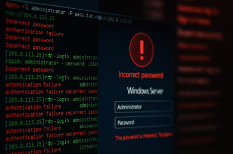
</p>

---

## 📌 Executive Summary

This investigation reconstructed a password spray–driven compromise against a cloud-hosted Windows VM in the cyber range. The attacker obtained access over RDP using the `slflare` account from external IP `159.26.106.84`, executed a suspicious binary (`msupdate.exe`), established scheduled-task persistence (`MicrosoftUpdateSync`), weakened Defender by excluding `C:\Windows\Temp`, and then performed host discovery. The intrusion progressed into collection and outbound communication, including creation of `backup_sync.zip`, a beacon/C2 connection to `185.92.220.87`, and an exfiltration attempt to `185.92.220.87:8081`. Overall, the activity reflects a complete attack chain from initial access through execution, persistence, evasion, discovery, collection, command and control, and exfiltration.

---

## 🎯 Hunt Objectives

- Identify malicious activity across endpoint, process, registry, file, and network telemetry
- Reconstruct the attacker timeline from initial access to outbound activity
- Map observed behavior to MITRE ATT&CK techniques
- Preserve the KQL hunt logic used to Findings each flag
- Document detection opportunities and defensive improvements

---

## 🧭 Scope & Environment

- **Scenario:** Cyber Range SOC – Virtual Machine Compromise
- **Hunt Name:** Password Spray Leads to Full Compromise
- **Primary Endpoint:** `slflarewinsysmo` (exact hostname used in later confirmed queries)
- **Target Pattern:** `DeviceName contains "flare"`
- **Compromised Account:** `slflare`
- **Incident Date:** `2025-09-14`
- **Investigative Window Used in Queries:** `2025-09-14 → 2025-11-01`
- **Data Sources:** Microsoft Defender for Endpoint Advanced Hunting, Microsoft Sentinel-style KQL, `DeviceLogonEvents`, `DeviceProcessEvents`, `DeviceEvents`, `DeviceRegistryEvents`, `DeviceFileEvents`, `DeviceNetworkEvents`

---

## 📚 Table of Contents

- [🧠 Hunt Overview](#-hunt-overview)
- [🕒 Reconstructed Attack Flow](#-reconstructed-attack-flow)
- [🧬 MITRE ATT&CK Summary](#-mitre-attck-summary)
- [🔍 Flag Analysis](#-flag-analysis)
  - [🚩 Flag 1](#-flag-1)
  - [🚩 Flag 2](#-flag-2)
  - [🚩 Flag 3](#-flag-3)
  - [🚩 Flag 4](#-flag-4)
  - [🚩 Flag 5](#-flag-5)
  - [🚩 Flag 6](#-flag-6)
  - [🚩 Flag 7](#-flag-7)
  - [🚩 Flag 8](#-flag-8)
  - [🚩 Flag 9](#-flag-9)
  - [🚩 Flag 10](#-flag-10)
- [🚨 Detection Gaps & Recommendations](#-detection-gaps--recommendations)
- [🧾 Final Assessment](#-final-assessment)
- [📎 Analyst Notes](#-analyst-notes)

---

## 🧠 Hunt Overview

The attack began with repeated RDP authentication attempts against a cloud virtual machine whose device name matched `flare`. Those attempts culminated in a successful RDP login from `159.26.106.84` using the `slflare` account. After access was obtained, the attacker executed `msupdate.exe` from a suspicious user-writable location and leveraged a PowerShell-based command line to run a follow-on script.

The intrusion then advanced into persistence and defense evasion. A scheduled task named `MicrosoftUpdateSync` was created to maintain execution after reboot or logoff, and Microsoft Defender was weakened through an exclusion for `C:\Windows\Temp`. Once foothold and evasion were in place, the attacker ran discovery with `"cmd.exe" /c systeminfo`, prepared data for theft by creating `backup_sync.zip`, established outbound communications to `185.92.220.87`, and attempted exfiltration over port `8081`.

This hunt demonstrates a clean end-to-end intrusion path and is especially useful as a portfolio-ready example because each major phase was supported by reproducible Advanced Hunting queries.

---

## 🕒 Reconstructed Attack Flow

| Stage | Activity | Key Artifact |
|---|---|---|
| Initial Access | Successful RDP logon after password spray | `159.26.106.84`, `slflare` |
| Execution | Suspicious binary launched | `msupdate.exe` |
| Execution | PowerShell-style launch command used | `"msupdate.exe" -ExecutionPolicy Bypass -File C:\Users\Public\update_check.ps1` |
| Persistence | Scheduled task created | `MicrosoftUpdateSync` |
| Defense Evasion | Defender exclusion added | `C:\Windows\Temp` |
| Discovery | Host enumeration command executed | `"cmd.exe" /c systeminfo` |
| Collection | Archive staged locally | `backup_sync.zip` |
| Command and Control | External beacon / tooling destination | `185.92.220.87` |
| Exfiltration | Outbound exfil attempt | `185.92.220.87:8081` |

---

## 🧬 MITRE ATT&CK Summary

| Flag | Technique Category | MITRE ID | Priority |
|-----:|-------------------|----------|----------|
| 1 | Brute Force: Password Guessing | T1110.001 | High |
| 2 | Valid Accounts | T1078 | High |
| 3 | Windows Command Shell / User Execution | T1059.003 / T1204.002 | High |
| 4 | Command and Scripting Interpreter | T1059 | High |
| 5 | Scheduled Task/Job: Scheduled Task | T1053.005 | High |
| 6 | Impair Defenses: Disable or Modify Windows Defender | T1562.001 | High |
| 7 | System Information Discovery | T1082 | Medium |
| 8 | Archive Collected Data: Local Archiving | T1560.001 | High |
| 9 | Web Protocols / Ingress Tool Transfer | T1071.001 / T1105 | High |
| 10 | Exfiltration Over Unencrypted Protocol | T1048.003 | Critical |

---

## 🔍 Flag Analysis

_All flags below are collapsible for readability._

---

<details>
<summary id="-flag-1">🚩 <strong>Flag 1: Attacker IP Address</strong></summary>

### 🎯 Objective
Identify the earliest external IP address that successfully logged in via RDP after multiple failed attempts.

### 📌 Finding
The earliest successful external RDP source IP identified in the completed investigation was `159.26.106.84`.

### 🔍 Evidence

| Field | Value |
|------|-------|
| MITRE | `T1110.001 – Brute Force: Password Guessing` |
| Findings | `159.26.106.84` |
| Target Pattern | `DeviceName contains "flare"` |
| Related Account | `slflare` |
| Relevant Table | `DeviceLogonEvents` |

### 💡 Why it matters
This IP is the first confirmed external indicator tied to the successful access event. It provides the starting point for scoping related logons, geo-enrichment, blocking actions, and additional hunts for reuse across other endpoints.

### 🔧 KQL Query Used
```kusto
DeviceLogonEvents
| where Timestamp >= datetime(2025-09-14) and Timestamp < datetime(2025-11-01)
| where DeviceName contains "flare"
| where AccountName == "slflare"
| where ActionType == "LogonSuccess"
| project Timestamp, DeviceName, ActionType, AccountDomain, AccountName, RemoteIP, RemoteDeviceName, FailureReason, IsLocalAdmin
| order by Timestamp desc
```

### 🖼️ Screenshot
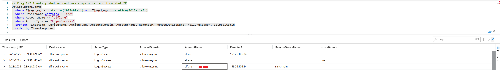

### 🛠️ Detection Recommendation

**Hunting Tip:**  
Build detections for repeated failed RDP attempts followed by a success from the same external IP within a short window.

</details>

---

<details>
<summary id="-flag-2">🚩 <strong>Flag 2: Compromised Account</strong></summary>

### 🎯 Objective
Determine which account was used during the successful RDP logon associated with the attacker IP.

### 📌 Finding
The compromised account used for the successful RDP access was `slflare`.

### 🔍 Evidence

| Field | Value |
|------|-------|
| MITRE | `T1078 – Valid Accounts` |
| Findings | `slflare` |
| Related IP | `159.26.106.84` |
| Relevant Table | `DeviceLogonEvents` |
| Access Method | RDP / Remote interactive logon pivot |

### 💡 Why it matters
Knowing the exact compromised account defines the attacker’s level of access and allows direct pivots into process execution, scheduled tasks, registry changes, and file creation performed in that user context.

### 🔧 KQL Query Used
```kusto
DeviceLogonEvents
| where Timestamp >= datetime(2025-09-14) and Timestamp < datetime(2025-11-01)
| where DeviceName contains "flare"
| where AccountName == "slflare"
| where ActionType == "LogonSuccess"
| project Timestamp, DeviceName, ActionType, AccountDomain, AccountName, RemoteIP, RemoteDeviceName, FailureReason, IsLocalAdmin
| order by Timestamp desc
```

### 🖼️ Screenshot
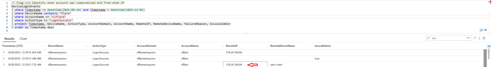

### 🛠️ Detection Recommendation

**Hunting Tip:**  
Alert on successful RDP logons to privileged or service-like accounts after bursts of failed authentication activity.

</details>

---

<details>
<summary id="-flag-3">🚩 <strong>Flag 3: Executed Binary Name</strong></summary>

### 🎯 Objective
Identify the binary executed by the attacker after gaining RDP access.

### 📌 Finding
The suspicious binary executed by the attacker was `msupdate.exe`.

### 🔍 Evidence

| Field | Value |
|------|-------|
| MITRE | `T1059.003`, `T1204.002` |
| Findings | `msupdate.exe` |
| Account Context | `slflare` |
| Hunt Focus | Suspicious paths such as Public, Temp, or Downloads |
| Relevant Table | `DeviceProcessEvents` |

### 💡 Why it matters
The binary represents the attacker’s first confirmed post-logon execution artifact and likely acted as the launcher or wrapper for the follow-on PowerShell payload.

### 🔧 KQL Query Used
```kusto
DeviceProcessEvents
| where Timestamp >= datetime(2025-09-14) and Timestamp < datetime(2025-11-01)
| where DeviceName contains "flare"
| where AccountName == "slflare"
| where FolderPath contains "public"
or FolderPath contains "temp"
or FolderPath contains "downloads"
| project TimeGenerated, AccountName, DeviceName, FileName, ProcessCommandLine
```

### 🖼️ Screenshot
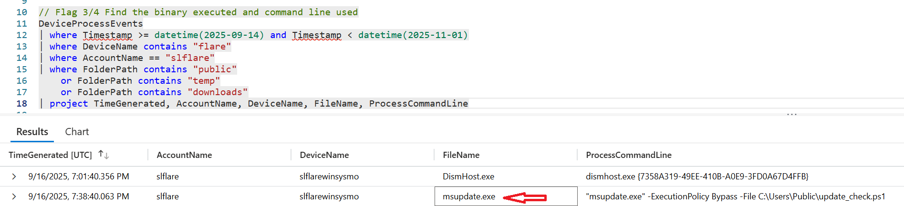

### 🛠️ Detection Recommendation

**Hunting Tip:**  
Monitor for executable launches from `C:\Users\Public`, `Temp`, and `Downloads`, especially immediately after interactive remote logons.

</details>

---

<details>
<summary id="-flag-4">🚩 <strong>Flag 4: Command Line Used to Execute the Binary</strong></summary>

### 🎯 Objective
Provide the full command line used to launch the suspicious binary from Flag 3.

### 📌 Finding
The command line used by the attacker was:

```text
"msupdate.exe" -ExecutionPolicy Bypass -File C:\Users\Public\update_check.ps1
```

### 🔍 Evidence

| Field | Value |
|------|-------|
| MITRE | `T1059 – Command and Scripting Interpreter` |
| Binary | `msupdate.exe` |
| PowerShell Indicator | `-ExecutionPolicy Bypass` |
| Follow-on Script | `C:\Users\Public\update_check.ps1` |
| Relevant Table | `DeviceProcessEvents` |

### 💡 Why it matters
The use of `-ExecutionPolicy Bypass` is a strong signal of malicious intent and shows that the attacker deliberately attempted to weaken native PowerShell safeguards while launching a script from a suspicious public path.

### 🔧 KQL Query Used
```kusto
DeviceProcessEvents
| where Timestamp >= datetime(2025-09-14) and Timestamp < datetime(2025-11-01)
| where DeviceName contains "flare"
| where AccountName == "slflare"
| where FolderPath contains "public"
or FolderPath contains "temp"
or FolderPath contains "downloads"
| project TimeGenerated, AccountName, DeviceName, FileName, ProcessCommandLine
```

### 🖼️ Screenshot
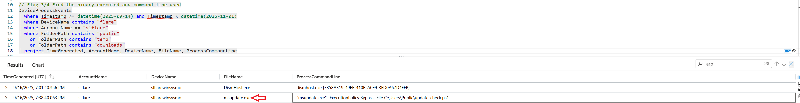

### 🛠️ Detection Recommendation

**Hunting Tip:**  
Flag any command line combining suspicious executables with PowerShell-style bypass arguments and script execution from user-writable directories.

</details>

---

<details>
<summary id="-flag-5">🚩 <strong>Flag 5: Persistence Mechanism Created</strong></summary>

### 🎯 Objective
Identify the scheduled task created by the attacker to survive reboot or logoff.

### 📌 Finding
The attacker-created scheduled task was `MicrosoftUpdateSync`.

### 🔍 Evidence

| Field | Value |
|------|-------|
| MITRE | `T1053.005 – Scheduled Task/Job: Scheduled Task` |
| Findings | `MicrosoftUpdateSync` |
| Relevant Table | `DeviceEvents` |
| ActionType | `ScheduledTaskCreated` |
| Pivot Window | `TimeGenerated > 2025-09-16T19:38:40.063299Z` |

### 💡 Why it matters
Scheduled-task persistence gives the attacker a reliable relaunch mechanism after interruption, making containment and eradication more difficult if the task is not removed during response.

### 🔧 KQL Query Used
```kusto
DeviceEvents
| where TimeGenerated > todatetime('2025-09-16T19:38:40.063299Z')
| where DeviceName contains "flare"
| where ActionType == "ScheduledTaskCreated"
| project Timestamp, DeviceName, ActionType, TaskName = tostring(AdditionalFields.TaskName), InitiatingProcessFileName, InitiatingProcessCommandLine
| order by Timestamp asc
```

### 🖼️ Screenshot
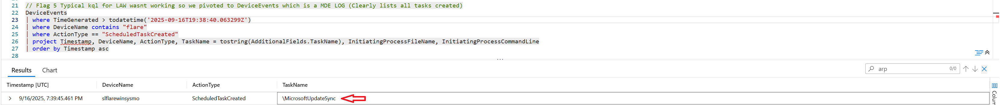

### 🛠️ Detection Recommendation

**Hunting Tip:**  
Alert on newly created scheduled tasks whose names imitate Microsoft update components or other trusted system functions.

</details>

---

<details>
<summary id="-flag-6">🚩 <strong>Flag 6: Defender Setting Modified</strong></summary>

### 🎯 Objective
Identify the folder path added to Microsoft Defender exclusions.

### 📌 Finding
The attacker added `C:\Windows\Temp` to Defender exclusions.

### 🔍 Evidence

| Field | Value |
|------|-------|
| MITRE | `T1562.001 – Impair Defenses: Disable or Modify Windows Defender` |
| Excluded Path | `C:\Windows\Temp` |
| Relevant Table | `DeviceRegistryEvents` |
| Registry Area | `Microsoft\Windows Defender\Exclusions\Paths` |
| Evasion Type | Folder-based scan exclusion |

### 💡 Why it matters
Excluding `C:\Windows\Temp` gives the attacker a convenient staging area for scripts, binaries, and archives that are less likely to be scanned or blocked by Defender.

### 🔧 KQL Query Used
```kusto
DeviceRegistryEvents
| where Timestamp >= datetime(2025-09-14) and Timestamp < datetime(2025-11-01)
| where DeviceName contains "flare"
| where RegistryKey contains @"\Microsoft\Windows Defender\Exclusions\Paths"
| project Timestamp, DeviceName, ActionType, RegistryKey, RegistryValueName, RegistryValueData, InitiatingProcessFileName, InitiatingProcessCommandLine, InitiatingProcessFolderPath
| order by Timestamp asc
```

### 🖼️ Screenshot
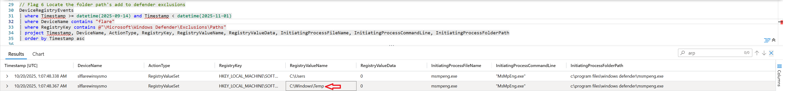

### 🛠️ Detection Recommendation

**Hunting Tip:**  
Treat any Defender exclusion added to common attacker staging locations such as `Temp`, `Public`, `AppData`, or `ProgramData` as high priority.

</details>

---

<details>
<summary id="-flag-7">🚩 <strong>Flag 7: Discovery Command Run</strong></summary>

### 🎯 Objective
Identify the earliest discovery command executed to enumerate the compromised host.

### 📌 Finding
The earliest discovery command identified was:

```text
"cmd.exe" /c systeminfo
```

### 🔍 Evidence

| Field | Value |
|------|-------|
| MITRE | `T1082 – System Information Discovery` |
| Findings | `"cmd.exe" /c systeminfo` |
| Exact Host | `slflarewinsysmo` |
| Relevant Table | `DeviceProcessEvents` |
| Hunt Terms | `systeminfo`, `hostname`, `ipconfig /all` |

### 💡 Why it matters
`systeminfo` is a classic built-in enumeration command used to gather OS, patching, hardware, and domain context, which helps an attacker shape next steps and identify weaknesses.

### 🔧 KQL Query Used
```kusto
DeviceProcessEvents
| where Timestamp >= datetime(2025-09-14) and Timestamp < datetime(2025-11-01)
| where DeviceName =~ "slflarewinsysmo"
| where ProcessCommandLine has_any ("systeminfo", "hostname", "ipconfig /all")
| project Timestamp, ProcessCommandLine, InitiatingProcessFileName, InitiatingProcessCommandLine
| order by Timestamp asc
```

### 🖼️ Screenshot
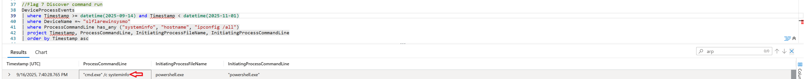

### 🛠️ Detection Recommendation

**Hunting Tip:**  
Pair post-compromise discovery commands with preceding defender tampering or persistence events to reduce false positives and prioritize true attack chains.

</details>

---

<details>
<summary id="-flag-8">🚩 <strong>Flag 8: Archive File Created by Attacker</strong></summary>

### 🎯 Objective
Identify the archive file created to prepare data for exfiltration.

### 📌 Finding
The attacker created `backup_sync.zip`.

### 🔍 Evidence

| Field | Value |
|------|-------|
| MITRE | `T1560.001 – Archive Collected Data: Local Archiving` |
| Findings | `backup_sync.zip` |
| Exact Host | `slflarewinsysmo` |
| Relevant Table | `DeviceFileEvents` |
| Hunt Focus | `.zip`, `.rar`, `.7z` files in Temp/AppData/ProgramData |

### 💡 Why it matters
Creation of a compressed archive indicates the attacker had moved beyond access and reconnaissance and was actively staging data for theft.

### 🔧 KQL Query Used
```kusto
DeviceFileEvents
| where Timestamp >= datetime(2025-09-14) and Timestamp < datetime(2025-11-01)
| where DeviceName =~ "slflarewinsysmo"
| where FileName has_any (".rar", ".zip", ".7z")
| where FolderPath has_any ("Temp", "Appdata", "ProgramData")
```

### 🖼️ Screenshot
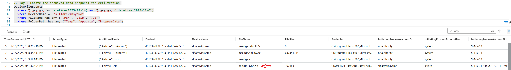

### 🛠️ Detection Recommendation

**Hunting Tip:**  
Track archive creation in suspicious directories, especially when it follows discovery commands and precedes unusual outbound connections.

</details>

---

<details>
<summary id="-flag-9">🚩 <strong>Flag 9: C2 Connection Destination</strong></summary>

### 🎯 Objective
Identify the destination used by the attacker’s beacon for remote access or additional tooling retrieval.

### 📌 Finding
The destination identified for command-and-control activity was `185.92.220.87`.

### 🔍 Evidence

| Field | Value |
|------|-------|
| MITRE | `T1071.001`, `T1105` |
| Findings | `185.92.220.87` |
| Exact Host | `slflarewinsysmo` |
| Relevant Table | `DeviceNetworkEvents` |
| Hunt Filter | `InitiatingProcessCommandLine has_any ("http", "https")` |

### 💡 Why it matters
This remote IP is the key network IOC connecting the endpoint to attacker-controlled or attacker-used infrastructure and should be prioritized for retrospective searching, blocking, and enrichment.

### 🔧 KQL Query Used
```kusto
DeviceNetworkEvents
| where Timestamp >= datetime(2025-09-14) and Timestamp < datetime(2025-11-01)
| where DeviceName =~ "slflarewinsysmo"
| where InitiatingProcessCommandLine has_any ("http", "https")
| project TimeGenerated, ActionType, DeviceName, InitiatingProcessCommandLine, LocalIP, RemoteIP, RemotePort
| order by TimeGenerated asc
```

### 🖼️ Screenshot
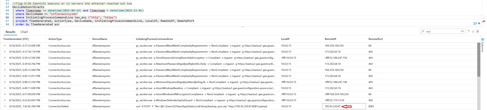

### 🛠️ Detection Recommendation

**Hunting Tip:**  
Generate network detections for HTTP/S communications initiated by suspicious processes or scripts shortly after initial execution and persistence events.

</details>

---

<details>
<summary id="-flag-10">🚩 <strong>Flag 10: Exfiltration Attempt Detected</strong></summary>

### 🎯 Objective
Identify the external IP and port used during the exfiltration attempt.

### 📌 Finding
The attacker attempted exfiltration to `185.92.220.87:8081`.

### 🔍 Evidence

| Field | Value |
|------|-------|
| MITRE | `T1048.003 – Exfiltration Over Unencrypted Protocol` |
| Findings | `185.92.220.87:8081` |
| Related Archive | `backup_sync.zip` |
| Related C2 IP | `185.92.220.87` |
| Relevant Table | `DeviceNetworkEvents` |

### 💡 Why it matters
The exfiltration destination confirms the attacker progressed to attempted data theft and ties local staging activity to specific outbound communications, which is critical for impact assessment and containment.

### 🔧 KQL Query Used
```kusto
DeviceNetworkEvents
| where Timestamp >= datetime(2025-09-14) and Timestamp < datetime(2025-11-01)
| where DeviceName =~ "slflarewinsysmo"
| where InitiatingProcessCommandLine has_any ("http", "https")
| project TimeGenerated, ActionType, DeviceName, InitiatingProcessCommandLine, LocalIP, RemoteIP, RemotePort
| order by TimeGenerated asc
```

### 🖼️ Screenshot
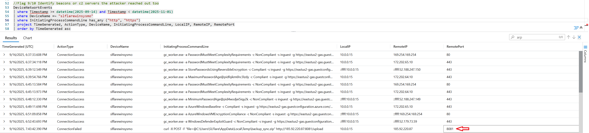

### 🛠️ Detection Recommendation

**Hunting Tip:**  
Escalate outbound traffic to uncommon ports when it follows archive creation or other collection activity on the same host.

</details>

---

## 🚨 Detection Gaps & Recommendations

### Observed Gaps
- The attacker was able to successfully use RDP after repeated failed authentication activity, suggesting insufficient preventive controls or alerting on password spray behavior.
- Execution from suspicious user-writable paths was not stopped before persistence and evasion were established.
- Defender exclusions and scheduled-task persistence were created before the activity chain was interrupted.

### Recommendations
- Restrict or remove direct RDP exposure to internet-facing cloud VMs, enforce MFA where possible, and alert on failed-to-successful RDP patterns from external IPs.
- Create detections for suspicious binaries, scripts, and archives launched or created in `Public`, `Temp`, `Downloads`, `AppData`, and `ProgramData`.
- Monitor and alert on `ScheduledTaskCreated`, Defender exclusion registry modifications, and outbound traffic to rare IPs or uncommon ports such as `8081`.
- Enrich detections by correlating authentication, process, registry, file, and network events into a single attack-chain view.
- Add blocking or isolation playbooks for confirmed malicious C2 destinations such as `185.92.220.87`.

---

## 🧾 Final Assessment

This PWDSpray investigation shows a realistic and complete compromise path: external password spray, successful RDP access, malicious execution, scheduled-task persistence, Defender evasion, host discovery, archive creation, beaconing, and attempted exfiltration. The attacker demonstrated enough tradecraft to maintain access and prepare data theft while relying on simple but effective built-in Windows mechanisms and low-complexity evasion. From a defender perspective, the strongest value in this hunt is the ability to connect each phase through reproducible KQL, making the case highly suitable for portfolio, interview, and tabletop use.

---

## 📎 Analyst Notes

- Report structured from the supplied markdown template and completed flag Findingss.
- KQL sections preserve the simple investigative logic used during the hunt.
- Exact screenshots were not included in the source file set, so screenshot placeholders were replaced with notes.
- Evidence in this report is limited to the Findingss and queries preserved in the provided artifacts.
- Suitable for portfolio presentation, interview walkthroughs, and future detection engineering reference.

---

## ✅ Final Findings Summary

| Flag | Findings |
|---:|---|
| 1 | `159.26.106.84` |
| 2 | `slflare` |
| 3 | `msupdate.exe` |
| 4 | `"msupdate.exe" -ExecutionPolicy Bypass -File C:\Users\Public\update_check.ps1` |
| 5 | `MicrosoftUpdateSync` |
| 6 | `C:\Windows\Temp` |
| 7 | `"cmd.exe" /c systeminfo` |
| 8 | `backup_sync.zip` |
| 9 | `185.92.220.87` |
| 10 | `185.92.220.87:8081` |
